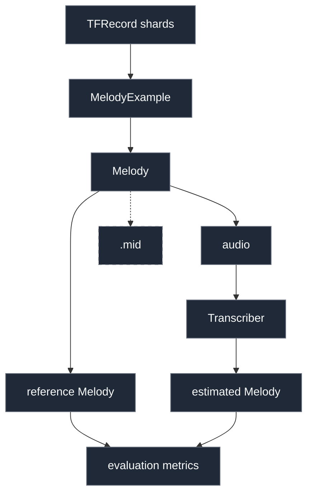

# Scribr

Scribr explores algorithmic, supervised deep learning, and LLM-based
approaches to automated music transcription for quantized monophonic audio.

The repository currently contains the shared infrastructure for these
approaches, not the approaches themselves:

- `scribr.representation` defines the canonical `Note`, `Melody`, and
  `MelodyExample` types and the dataset pitch-sequence codec.
- `scribr.data` streams the TFRecord dataset on demand.
- `scribr.synthesis` renders a `Melody` to audio with FluidSynth.
- `scribr.midi` exports a `Melody` to a Standard MIDI File.
- `scribr.transcription` defines the `Transcriber` protocol that every
  approach implements.
- `scribr.evaluation` scores a transcription against a reference
  `Melody` with `mir_eval`.

There are no implemented transcription approaches yet.

## Setup

### Requirements

- Python 3.13 or newer
- [uv](https://docs.astral.sh/uv/getting-started/installation/)
- FluidSynth and a General MIDI SoundFont (only for audio synthesis)

`uv sync` installs PyTorch, `numpy`, `mido`, `tfrecord`, `pyfluidsynth`,
`mir_eval`, and `pytest`. TensorFlow is not required.

### 1. Install dependencies

```bash
git clone https://github.com/rdguzman-dev/scribr && cd scribr
uv sync
```

### 2. Download the dataset

The dataset is the 4 Bars Monophonic Melodies Dataset (PitchSequence), which
is not committed to this repository. The download script fetches the published
archives from Zenodo, verifies their MD5 checksums, and extracts the shards into
the layout `MelodyDataset` expects:

```text
data/raw/4-bars-monophonic/
├── train/       # 8 shards, 10,126,676 melodies
├── validation/  # 8 shards, 70,908 melodies
└── test/        # 8 shards, 22,265 melodies
```

The dataset is licensed under [CC BY 4.0](https://creativecommons.org/licenses/by/4.0/).

**Dataset:** Pettenò, Matteo. *4 Bars Monophonic Melodies Dataset (Pitch
Sequence)*. Zenodo, 2024. [doi:10.5281/zenodo.13369389](https://doi.org/10.5281/zenodo.13369389)

To download all the shards, run:

```bash
uv run python scripts/download_dataset.py  # all splits (~713 MB)
```

To download the shards of a specific split, run:

```bash
uv run python scripts/download_dataset.py --splits <split>
```

Replace `<split>` with one of `train`, `validation`, or `test`.

On macOS, if Python reports an `SSL: CERTIFICATE_VERIFY_FAILED` error when
connecting to Zenodo, run the certificate installer bundled with the
python.org Python installation:

```bash
open "/Applications/Python 3.13/Install Certificates.command"
```

Then retry the download command.

Use `--dest` to extract somewhere else, then set `SCRIBR_DATA_ROOT` to that
directory. Shards already on disk are skipped, and `--force` re-downloads
them.

### 3. Set up a SoundFont (synthesis only)

Synthesis needs the FluidSynth system library and a General MIDI SoundFont
(`.sf2` or `.sf3`).

To install the library on macOS (using Homebrew), run:

```bash
brew install fluid-synth
```

To install the library on Debian/Ubuntu, run:

```bash
sudo apt install libfluidsynth3
```

Then download a SoundFont such as
[GeneralUser GS](https://schristiancollins.com/generaluser.php) and point
Scribr at it:

```bash
export SCRIBR_SOUNDFONT=/path/to/GeneralUser-GS.sf2
```

SoundFonts are separate from the dataset and may have their own license terms.
Make sure to check the license of the SoundFont you use.

`Synthesizer(soundfont_path=...)` also accepts a path directly. On macOS,
Scribr sets `HOMEBREW_PREFIX` to `/opt/homebrew` when it is unset and the
Homebrew FluidSynth library is present there.

### 4. Verify the install

```bash
uv run pytest
uv run scribr  # prints a short banner if the package is importable
```

Unit tests use committed fixtures and a fake FluidSynth backend, so they pass
without the dataset or a SoundFont. The FluidSynth integration test is
skipped unless `SCRIBR_SOUNDFONT` is set:

```bash
uv run pytest -m integration
```

## Architecture

### Package layout

```text
src/scribr/
├── representation/   # Note, Melody, MelodyExample, pitch-sequence codec
├── data/             # lazy TFRecord access (MelodyDataset)
├── synthesis/        # Melody -> audio (Synthesizer)
├── midi/             # Melody -> .mid (write_midi)
├── transcription.py  # Transcriber protocol (audio -> Melody)
└── evaluation/       # mir_eval metrics (evaluate, evaluate_transcriber)
scripts/download_dataset.py
tests/
```

### Data flow



Every approach implements `Transcriber` and returns a `Melody`, so predictions
and ground truth share one type.

The canonical in-memory transcription is a symbolic `Melody`, not a MIDI file
or a pitch-sequence token list. Time is measured in quarter-note beats from
the start of the melody, so `Note(pitch=60, onset=1.5, offset=1.75)` starts
1.5 beats in and lasts one 16th note. Ground truth and predictions use the
same type and the same units, so an evaluator can compare them directly.

### Dataset

`MelodyDataset` lazily streams one split through
`tfrecord.torch.TFRecordDataset` and returns one `MelodyExample` per record:

```python
from scribr.data import MelodyDataset

dataset = MelodyDataset(split="test")
example = next(iter(dataset))      # iterate; there is no indexing or len()
print(example.melody.notes[:3])    # (Note(pitch=63, onset=0.0, offset=0.75), ...)
print(example.attributes["note_density"])
print(example.pitch_sequence[:8])  # (63, 128, 128, 64, ...) pitch-sequence tokens
```

Each melody contains 64 steps: 4 bars of 4/4, quantized to 4 steps per quarter
note. A step is a MIDI pitch (`21-108`), `128` (hold the current note), or `129`
(no note sounding). A new pitch token ends the current note, so consecutive
identical tokens decode to separate notes. The 13 attributes computed by the
dataset authors are preserved on `MelodyExample.attributes`.

`MelodyDataset` subclasses `torch.utils.data.IterableDataset`, so a
`DataLoader` can wrap it. Workers split the shard files round-robin and no
record is read twice. The split is never materialized: there is no index, no
manifest, and no `len()`, because counting records would require a full scan.

#### Reproducible subsets

The train split has 10 million melodies, so bound it with `max_examples` and
shuffle with a seeded bounded buffer:

```python
dataset = MelodyDataset(
    split="train",
    max_examples=100_000,  # per worker
    seed=42,               # deterministic shuffle order
    shuffle=True,
    shuffle_buffer_size=10_000,
)
```

`max_examples` limits the number of examples yielded per worker, so with
multiple `DataLoader` workers the total can be larger than `max_examples`. The
subset is drawn from the stored shard order, optionally shuffled. Both the
subset and the shuffle are deterministic for a given seed, memory stays bounded
by the buffer, and the official train/validation/test boundaries are always
preserved.

### Synthesis

`Synthesizer` renders a `Melody` to a mono `float32` waveform in memory. Audio is
synthesized on demand from dataset melodies and is not distributed or stored by
Scribr.

```python
from scribr.data import MelodyDataset
from scribr.synthesis import Synthesizer

dataset = MelodyDataset(
    split="train",
    max_examples=10,
)
example = next(iter(dataset))
synthesizer = Synthesizer()
audio = synthesizer.synthesize(example.melody)
```

The audio waveform is a 1-D `float32` array in `[-1, 1]`. Each call creates a
fresh FluidSynth instance, so release tails and controller state cannot leak
from one melody into the next, and nothing is written to disk. `soundfont_path`,
`sample_rate`, `tempo`, `program`, `velocity`, `gain`, `release_tail_seconds`,
and `midi_channel` are constructor arguments.

### MIDI export

MIDI is an export format only. Nothing in the dataset, synthesis, or
evaluation path reads it. `write_midi` writes one monophonic track:

```python
from scribr.data import MelodyDataset
from scribr.midi import MidiExportConfig, write_midi

example = next(iter(MelodyDataset(split="test")))
write_midi(
    example.melody,
    "output.mid",
    MidiExportConfig(
        tempo=120.0,
        program=0,  # 0 = Acoustic Grand Piano
    ),
)
```

At the default 480 ticks per beat, one dataset step is 120 ticks. Adjacent
notes with the same pitch are released before being re-attacked, so repeated
pitches stay separate notes instead of merging.

### Transcription approaches

No transcription approach is implemented yet. Each one should implement
`Transcriber` and return the canonical `Melody`:

```python
import numpy as np

from scribr.representation import Melody


class MyTranscriber:
    def transcribe(
        self,
        audio: np.ndarray,
        sample_rate: int,
        tempo: float,
    ) -> Melody:
        raise NotImplementedError("algorithmic / DL / LLM approach")
```

The harness should pass raw `Synthesizer.synthesize` output, `sample_rate` in
Hz, and the `tempo` in BPM the audio was rendered at. Any resampling,
normalization, or feature extraction is the approach's business. The returned
`Melody` uses quarter-note beats measured from the first audio sample, the
same convention as the dataset. An empty `Melody` is a valid transcription of
silence.

Approaches don't need to quantize to the dataset's 16th-note grid. `mir_eval`
matches onsets within a tolerance, so near-grid timings still score, and a
model that predicts a pitch sequence can decode it with
`decode_pitch_sequence` before returning.

### Evaluation

`evaluate` scores one prediction against one reference. `evaluate_transcriber`
synthesizes each reference melody, runs an approach, and averages the metrics:

```python
from scribr.data import MelodyDataset
from scribr.evaluation import evaluate, evaluate_transcriber
from scribr.synthesis import Synthesizer

synthesizer = Synthesizer()
dataset = MelodyDataset(
    split="validation",
    max_examples=100,
)

report = evaluate_transcriber(
    MyTranscriber(),
    dataset,
    synthesizer,
)
print(
    report.num_examples,
    report.metrics["F-measure_no_offset"],
)
```

For a single example:

```python
example = next(iter(dataset))
audio = synthesizer.synthesize(example.melody)
estimate = MyTranscriber().transcribe(
    audio,
    synthesizer.sample_rate, 
    synthesizer.tempo,
)
scores = evaluate(
    example.melody,
    estimate,
    tempo=synthesizer.tempo,
)
```

The metrics mirror `mir_eval.transcription.evaluate`:

- `Precision`, `Recall`, `F-measure`: onset, pitch, and offset must match.
- `*_no_offset`: onset and pitch must match, offsets are ignored.
- `Onset_*`: only onsets are compared.
- `Offset_*`: only offsets are compared.

Defaults are 50 ms onset tolerance, 50 cents pitch tolerance, and an offset
tolerance of 20% of the reference note duration (with a 50 ms floor). All are
function arguments. `melody_to_mir_eval` converts beats to seconds and MIDI
numbers to Hz for `mir_eval`; skipping the Hz conversion would make a semitone
look like 28.6 cents instead of 100.

`evaluate_transcriber` averages each metric across examples, so every example
weighs the same regardless of note count. Silent examples score 0 because
`mir_eval` defines the metrics that way; filter them out beforehand if that
skews a comparison. Synthesis also adds a release tail after the last
note-off, and piano releases bleed across short notes, so offsets detected
from audio are fuzzy. Compare approaches on `F-measure_no_offset` first and
treat the offset-aware numbers as a secondary signal.

## Tests

```bash
uv run pytest                 # unit tests, no dataset or SoundFont needed
uv run pytest -m integration  # FluidSynth rendering (needs SCRIBR_SOUNDFONT)
```

Unit tests use byte-identical prefixes of real published shards
(`tests/fixtures/`) and a fake FluidSynth backend. The integration test is
skipped unless `SCRIBR_SOUNDFONT` points at an existing SoundFont.
